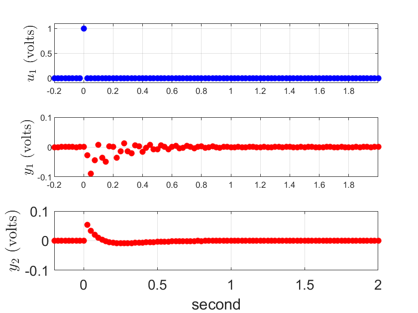
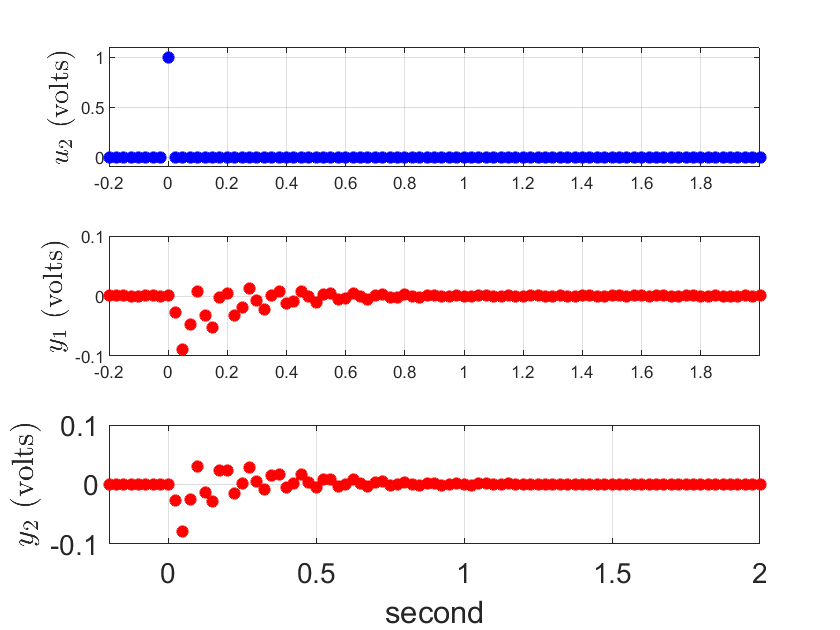
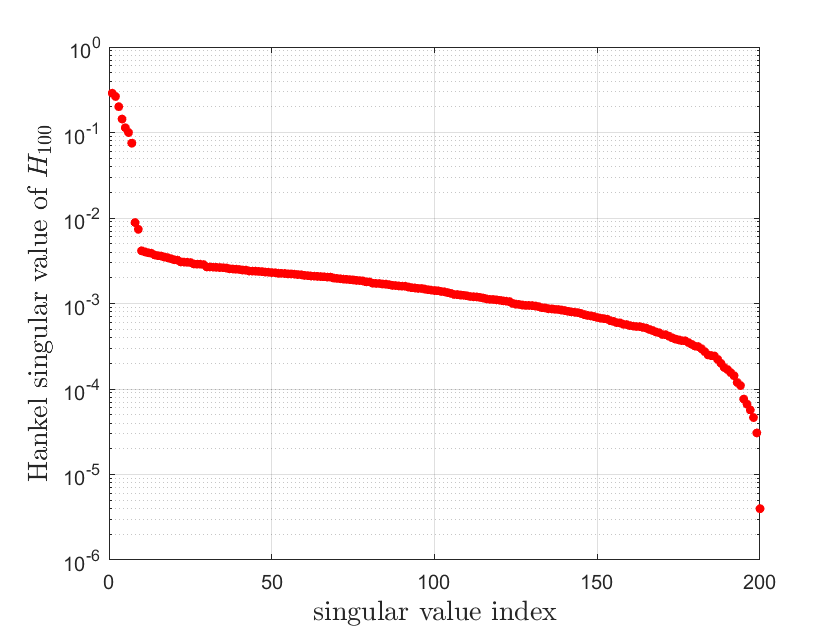
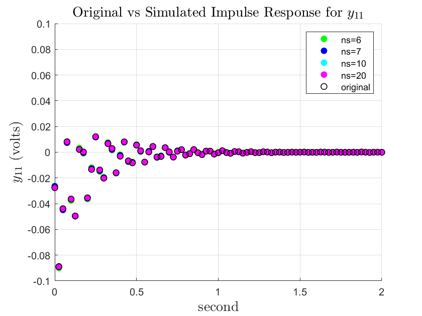
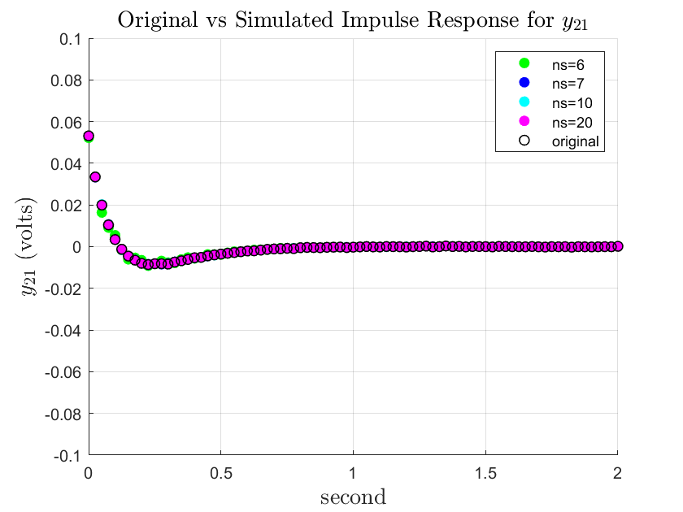
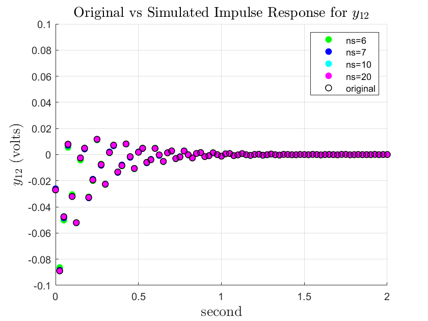
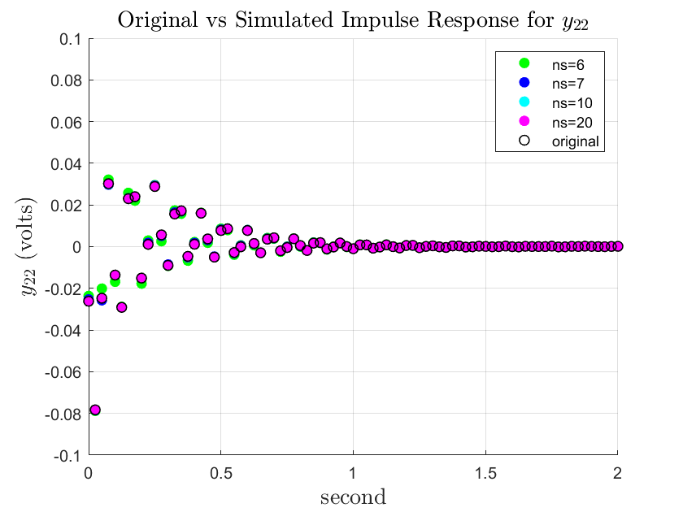

# Model (System) Identification
Consider a MIMO system - _m_ outputs, _q_ inputs, _ns_ states:


## Impulse Response Data
Data provided is an input-output data provided by two-input/two-output system. u1_impulse.mat and u2_impulse.mat data with only one input channel is "on" in each data set. The state dimension is not known,
with the objective being the determination of a state-space discrete time system that can replicate the observed data.

```Matlab
load data/u1_impulse.mat
load data/u2_impulse.mat
% input channel 1 'on'
y11 = u1_impulse.Y(3).Data;
y21 = u1_impulse.Y(4).Data;
u1 = u1_impulse.Y(1).Data;
% input channel 2 'on'
y12 = u2_impulse.Y(3).Data;
y22 = u2_impulse.Y(4).Data;
u2 = u2_impulse.Y(2).Data;
```
### Data with impulse input on channel 1:



### Data with impulse input on channel 2:


## Hankel Matrix
The pulse response sequence, _h<sub>k</sub>_, is obtained by combining the impulse response for each impulse input into each channel when _x<sub>o</sub>_ = 0. The _r<sup>th</sup>_ column of _h<sub>k</sub>_ is obtained when the _r<sup>th</sup>_ element of _u<sub>o</sub>_ is 1 and all other elements are zero. With a state space model described above, we can show that:


The pulse response sequence can be organized into an _mn x nq_ Hankel Matrix, _H<sub>n</sub>_:


```Matlab
% =========== H100 ============
number = 100;
H = zeros(2*number, 2*number);
for i = 1:number
    for j = 1:number
        k = i+j-1;
        H(2*i-1,2*j-1) = y11(k+mi);
        H(2*i,2*j-1) = y21(k+mi);
    
        H(2*i-1,2*j) = y12(k+mi);
        H(2*i,2*j) = y22(k+mi);
    end
end

[U, S, V] = svd(H);
```

Since the state dimension is not known, we can approximate the state dimension through obtaining the singular values of the Hankel matrix. And from the plot, we can see that there are 9 singular values that are significant. 


## Impulse Response Simulation
By virtue of the definition of Hankel Matrix:


Through singular value decomposition, we can obtain the following relationship:


Through factorization the observability and controllability matrix can be obtained:


To recover the state matrix, A, a new Hankel Matrix is computed:


```Matlab
H_tilt = zeros(2*number, 2*number);
for i = 1:number
    for j = 1:number
        k = i+j;
        H_tilt(2*i-1,2*j-1) = y11(k+mi);
        H_tilt(2*i,2*j-1) = y21(k+mi);
    
        H_tilt(2*i-1,2*j) = y12(k+mi);
        H_tilt(2*i,2*j) = y22(k+mi);
    end
end

%% H_100, ns = [6,7,10,20]

% build ns = [6,7,10,20] model
ns = 6;
H100_6 = U(:,1:ns)*S(1:ns,1:ns)*V(:,1:ns)';
ns = 7;
H100_7 = U(:,1:ns)*S(1:ns,1:ns)*V(:,1:ns)';
ns = 10;
H100_10 = U(:,1:ns)*S(1:ns,1:ns)*V(:,1:ns)';
ns = 20;
H100_20 = U(:,1:ns)*S(1:ns,1:ns)*V(:,1:ns)';

% ========== H100_6 impulse response ===========
y11_6 = zeros(1, 201);
y21_6 = zeros(1, 201);
y12_6 = zeros(1, 201);
y22_6 = zeros(1, 201);

for i = 1:number
    for j = 1:number
        k = i+j-1;
        y11_6(k) = H100_6(2*i-1,2*j-1);
        y21_6(k) = H100_6(2*i,2*j-1);
    
        y12_6(k) = H100_6(2*i-1,2*j);
        y22_6(k) = H100_6(2*i,2*j);
    end
end
%... repeat the process with states 7,10,20%
```



With the state dimension 6,7,10,and 20, each corresponding state matrix can be recovered using the following formula:


```Matlab
ns = 6;
O_6 = U(:,1:ns)*sqrt(S(1:ns,1:ns));
C_6 = sqrt(S(1:ns,1:ns))*V(:,1:ns)';
A6 = pinv(O_6) * H_tilt * pinv(C_6);
C6 = O_6(1:2, 1:ns);
B6 = C_6(1:ns, 1:2);

ns = 7;
O_7 = U(:,1:ns)*sqrt(S(1:ns,1:ns));
C_7 = sqrt(S(1:ns,1:ns))*V(:,1:ns)';
A7 = pinv(O_7) * H_tilt * pinv(C_7);
C7 = O_7(1:2, 1:ns);
B7 = C_7(1:ns, 1:2);

ns = 10;
O_10 = U(:,1:ns)*sqrt(S(1:ns,1:ns));
C_10 = sqrt(S(1:ns,1:ns))*V(:,1:ns)';
A10 = pinv(O_10) * H_tilt * pinv(C_10);
C10 = O_10(1:2, 1:ns);
B10 = C_10(1:ns, 1:2);

ns = 20;
O_20 = U(:,1:ns)*sqrt(S(1:ns,1:ns));
C_20 = sqrt(S(1:ns,1:ns))*V(:,1:ns)';
A20 = pinv(O_20) * H_tilt * pinv(C_20);
C20 = O_20(1:2, 1:ns);
B20 = C_20(1:ns, 1:2);
```


## References
[1] Linear Dynamic System, R. M'Closkey, (Final Project prepared by the instructor)
